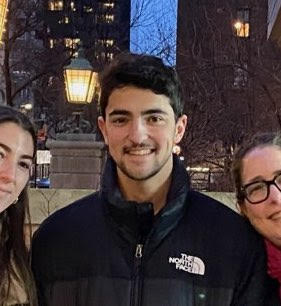

## Benjamin D. Hayum

*PhD Student in Computer Science at the University of Wisconsin - Madison*

*Founder and Research Lead of the Wisconsin AI Safety Initiative*

### Research Interests

Sociotechnical AI Safety. 

Scaling and Foundation Models. 

Learning Dynamics and Interpretability. 

Evaluations and Robustness. 

Neurobiology Parallels.

### Get to know me

Hey all, I’m Ben Hayum, a PhD student in Computer Sciences at the University of Wisconsin-Madison. 

I was fortunate to be exposed to information and networks somewhat early on in my college career that convinced me of just how massive the influence of AI was going to be on the future. Sitting with that realization over and over again made me know that there was simply no way I couldn't get involved and try to help guide the trajectory. This lead me to found the [Wisconsin AI Safety Initiative](https://waisi.org/) which in 3 short semesters has now taught over 100 students about the spectrum of benefits, harms and risks due to AI, as well as the many technical and policy proposals to solve them. We currently retain around 35-40 students who participate in weekly frontier paper readings groups and many of whom are actively engaged with research on campus, spanning the laboratories of 7 different professors.

This also lead me to research with Professor Sharon Li exploring how Reinforcement Learning from Human Feedback (RLHF) influences the probability distributions of behaviors in Large Language Models. I worked with the Stanford Existential Risk Initiative in weeks of workshops philosophically decompising concepts related to AI Alignment. Before this, I worked in the Banks Laboratory, where I focused on interpreting complex neurometrics and presented my findings at the Society for Neuroscience Conference. It may then come as little surprise that I am also really into meditation, mental health, and performance.

Feel free to reach out to me at [bhayum@wisc.edu](mailto:bhayum@wisc.edu) to discuss research, the future of AI, getting involved with WAISI, or anything in between!
